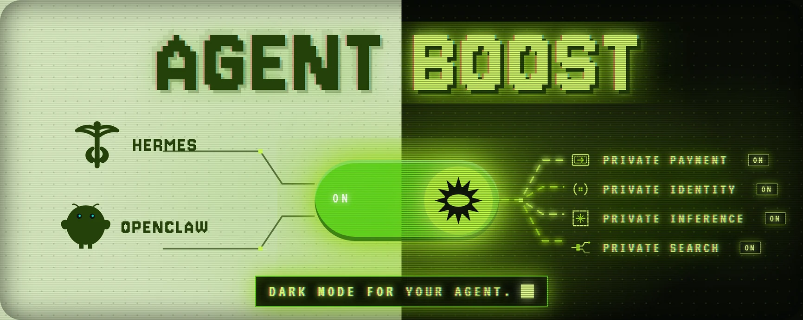
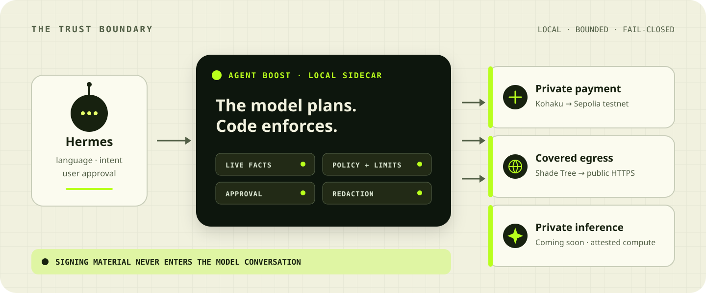
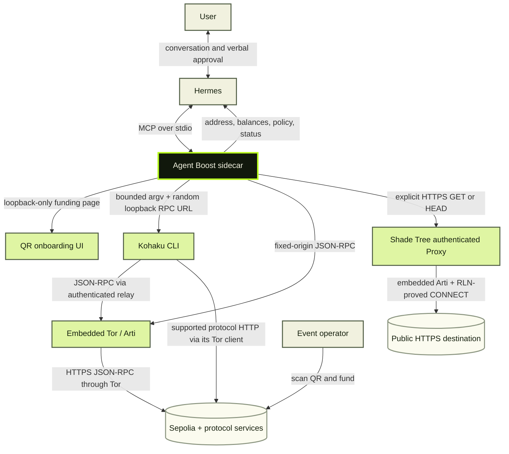

# Agent Boost

**Private payments for Hermes.**

[![ci][ci-badge]][ci-url]
[![clean install][install-badge]][install-url]
[![Node.js 22+][node-badge]][node-url]
[![Hermes 0.16+][hermes-badge]][hermes-url]
![research preview][preview-badge]
[![license][license-badge]][license-url]

Give your agent a wallet. Keep the keys out of its context.

Agent Boost gives Hermes fresh wallet addresses and shielded Sepolia payments.
You set spending limits and review the exact payment before submission.
Runs locally. Powered by Kohaku.

**Wallet: research preview. Private search and private inference: coming soon.**

> Sepolia testnet only. Unaudited research software. Use disposable test funds;
> never send mainnet assets or real value.

**[Get started](#get-started)** · [Payment walkthrough](docs/DEMO.md) ·
[Future work](#future-work) · [Privacy boundaries](#privacy-boundaries) ·
[All docs](docs/README.md)

## Future work

- **Kohaku integration: research preview.** Wallet setup, fresh addresses,
  shielding, and private Sepolia test payments are implemented through Kohaku.
  See the [architecture](docs/ARCHITECTURE.md).
- **MCP/policy framework: research preview.** Hermes connects through MCP;
  spending limits, expiry, approval rules, and duplicate-execution protection
  are enforced in code. See the [integration](docs/INTEGRATION.md) and
  [capability contract](docs/CAPABILITY-CONTRACT.md).
- **Anonymous inference: next, coming soon.** We plan to support the draft
  [Attested Confidential Inference (ACI) standard](https://github.com/Dstack-TEE/private-ai-gateway/blob/main/spec/aci.md)
  for attested confidential execution and
  [ZK API usage credits](https://ethresear.ch/t/zk-api-usage-credits-llms-and-beyond/24104)
  for anonymous paid access.
- **Private search: after anonymous inference, coming soon.** Planned work
  draws on the [Tiptoe paper](https://eprint.iacr.org/2023/1438) and our
  [private-re-search research and prototypes](https://github.com/dmarzzz/private-re-search).
  We plan to extend the same
  [ZK API usage credits](https://ethresear.ch/t/zk-api-usage-credits-llms-and-beyond/24104)
  approach to anonymous paid search.

## Get started

You need a working Hermes install, Git, Node.js 22+, and npm. The wallet preview
supports macOS (Apple silicon and Intel) and Ubuntu 24.04 ARM64.

```console
git clone https://github.com/dmarzzz/agent-boost.git
cd agent-boost
make install
```

Restart Hermes, then say:

> Set up Agent Boost for me.

Hermes creates a wallet and shows a funding QR. Send the requested Sepolia test
ETH, then tell Hermes you sent it. Agent Boost shields `0.1` Sepolia ETH through
Kohaku and reports when the private balance is ready.

Next, ask for a payment:

> Send 0.02 Sepolia ETH privately to 0x2222…2222.

Use your intended recipient's full address. Hermes shows the amount and
recipient for approval before submission. The [walkthrough](docs/DEMO.md)
covers funding, permissions, payment status, and starting a new demo wallet.
See [installation details](docs/INSTALL.md) for paths, pins, and troubleshooting.

## Available and coming next

| Capability | Status | What you get |
| --- | --- | --- |
| Wallet addresses + private payments | Research preview | Fresh Ethereum accounts and shielded Sepolia test payments through Kohaku. |
| Private search | Coming soon | An upcoming search capability. |
| Private inference | Coming soon | An upcoming path for selected subproblems to run on attested confidential compute. |

<details>
<summary>Also available: covered HTTPS reads through Shade Tree</summary>

After Grove enrollment, Hermes can fetch one public HTTPS resource through
Shade Tree over Tor, with no direct fallback. Say:

> Fetch https://example.com/data.json through covered egress.

This applies to that explicit request. It is separate from the upcoming private
search product and does not reroute the whole agent session. Supported on macOS
Apple silicon and Ubuntu 24.04 ARM64; the current Shade Tree binary is not
available for Intel Macs. See [covered egress](docs/COVERED-EGRESS.md).

</details>

## How it works



Hermes handles the conversation. Agent Boost is the local service that:

- reads current balances and readiness;
- checks spending limits and prepares the exact payment;
- requests approval before submission;
- tracks submission status and prevents duplicate execution;
- keeps signing material out of the model conversation.

Kohaku handles wallet cryptography and signing. Agent Boost communicates with
Hermes through MCP. Wallet RPC runs over Tor with no direct-network fallback.

The design rule is simple: a better model should improve the conversation;
balances and payment rules belong in code. Read the
[architecture](docs/ARCHITECTURE.md) and
[product philosophy](docs/PRODUCT-PHILOSOPHY.md).

### System map



## Privacy boundaries

The preview improves privacy within specific operations. It does not promise
anonymity or make the whole Hermes session private.

- **On-chain activity:** initial funding is public. Shielding reduces direct
  linkability, but timing, amounts, and the small testnet anonymity set can
  still correlate activity.
- **Network scope:** wallet RPC uses Tor; the provider still sees RPC methods
  and payloads. Shade Tree covers explicit HTTPS reads after enrollment.
  Model-provider, browser, and other process traffic remain outside that scope.
- **Local custody:** keys stay out of prompts and tool results. Hermes and
  Agent Boost run as the same OS user, so a privileged local process can still
  access wallet files. This is not a hardware custody boundary.
- **Approval:** confirmation is mediated by Hermes. It is not independent
  authentication against a compromised agent.

Read the full [privacy claims](docs/PRIVACY.md) and
[threat model](docs/THREAT-MODEL.md). Report vulnerabilities through
[Security](SECURITY.md).

## Developer docs

| Read | For |
| --- | --- |
| [Tools](docs/TOOLS.md) | MCP tools, inputs, and results |
| [Architecture](docs/ARCHITECTURE.md) | Components and state machines |
| [Capability contract](docs/CAPABILITY-CONTRACT.md) | Guarantees and result envelopes |
| [Configuration](docs/CONFIGURATION.md) | Settings and defaults |
| [All docs](docs/README.md) | Full documentation index |

## Development

```console
npm ci
npm run check
npm test
npm run build
```

See [Contributing](CONTRIBUTING.md) for conventions and the test layout.

## License

Released under the [MIT License](LICENSE).

The wallet preview remains unaudited research software. The license grants
permission to use the code; it does not make the software safe for mainnet
assets or real value.

[ci-badge]: https://github.com/dmarzzz/agent-boost/actions/workflows/ci.yml/badge.svg
[ci-url]: https://github.com/dmarzzz/agent-boost/actions/workflows/ci.yml
[install-badge]: https://github.com/dmarzzz/agent-boost/actions/workflows/release-matrix.yml/badge.svg
[install-url]: https://github.com/dmarzzz/agent-boost/actions/workflows/release-matrix.yml
[node-badge]: https://img.shields.io/badge/node-%3E%3D22-3f8f14.svg
[node-url]: https://nodejs.org/en/download
[hermes-badge]: https://img.shields.io/badge/hermes-0.16%2B-3f8f14.svg
[hermes-url]: integrations/hermes/agent-boost/SKILL.md
[preview-badge]: https://img.shields.io/badge/status-research%20preview-9ee01e.svg
[license-badge]: https://img.shields.io/badge/license-MIT-blue.svg
[license-url]: LICENSE
