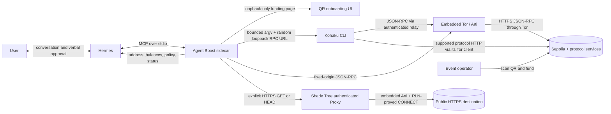

# Agent Boost

**Dark mode for your agent.**

[![ci][ci-badge]][ci-url]
[![clean install][install-badge]][install-url]
[![Node.js 22+][node-badge]][node-url]
[![Hermes 0.16+][hermes-badge]][hermes-url]
![research preview][preview-badge]
[![license][license-badge]][license-url]

[Install](#install) · [Run the demo](#run-the-demo) · [Tools](#tools) ·
[Architecture](docs/ARCHITECTURE.md) · [Threat model](docs/THREAT-MODEL.md) ·
[Capability contract](docs/CAPABILITY-CONTRACT.md) ·
[Covered egress](docs/COVERED-EGRESS.md) · [Security](SECURITY.md) ·
[Contributing](CONTRIBUTING.md)

Agent Boost is a local sidecar that gives a Hermes agent private money, a
private identity, and anonymous egress without ever handing it a key.

- **Private payment and identity**: stealth Ethereum addresses and balances
  through Kohaku, and shielded Zcash through Zallet; the agent sees addresses
  and balances, never keys.
- **Anonymous egress**: public HTTPS reads through a Shade Tree, or a grove of
  them, over Tor with no direct fallback.
- **Private inference**: sensitive subproblems sent to an attested confidential
  model, with a receipt the sidecar verifies.

> [!WARNING]
> Unaudited research software. Sepolia-only, disposable test funds. Never send
> mainnet assets, real value, or a wallet you care about.

## Install

Supported hosts:

- macOS on Apple silicon;
- macOS on Intel;
- Ubuntu 24.04 on ARM64.

Every change runs the same clean-tarball install smoke on native GitHub runners
for Ubuntu 24.04 ARM64, macOS ARM64, and macOS Intel. The smoke installs into an
empty prefix, starts the packaged executable, loads runtime configuration,
checks both Hermes skills, and rejects private planning material in the package.

Prerequisites are Git, Node.js 22 or newer, npm, and a working Hermes install.
No system Tor installation is required; the POC embeds Arti through `tor-js`.
The installer builds the repository, installs Agent Boost under `~/.local`,
fetches and verifies the pinned Kohaku commit, installs the checksummed Shade
Tree v0.4.0 live client where upstream publishes one, and configures the active
Hermes profile without replacing a conflicting MCP entry. Covered egress is
currently supported on Ubuntu ARM64 and macOS Apple silicon. The wallet remains
supported on macOS Intel, but Shade Tree v0.4.0 has no Intel live binary; the
installer reports that limitation instead of substituting an unproved route.

```console
git clone https://github.com/dmarzzz/agent-boost.git
cd agent-boost
make install
```

The default executables and state paths are:

```text
~/.local/bin/agent-boost
~/.local/share/agent-boost/dependencies/kohaku-cli/
~/.local/share/agent-boost/dependencies/shade-tree/
~/.local/share/agent-boost/state.json
~/.local/share/agent-boost/kohaku/
~/.local/share/agent-boost/tor/
~/.local/share/agent-boost/secrets/kohaku-password
~/.local/share/agent-boost/shade-tree/profile/
~/.local/share/agent-boost/shade-tree/slots/
```

If the installer says `~/.local/bin` is not on `PATH`, add it before continuing.
The installer prints the exact conversational handoff. Restart Hermes once,
then tell it:

> Set up Agent Boost for me.

Hermes creates the wallet, presents the exact address and QR, and asks you to
reply with ✅ or say `sent` after sending the displayed Sepolia ETH. No terminal
or MCP command is needed after installation.

To run an optional host diagnostic before the demo:

```console
agent-boost doctor
```

If Hermes was not available during installation, configure it later with:

```console
agent-boost install-hermes
```

In an already-running Hermes conversation, the no-restart alternative is
`/reload-skills` followed by `/reload-mcp` locally, or `!reload-skills`
followed by `!reload-mcp` over Matrix.

The installer pins Kohaku to commit
[`fcf9defa4d5ff7f63222f1b3bbe2d30e631ceffd`](https://github.com/kassandraoftroy/kohaku-cli/commit/fcf9defa4d5ff7f63222f1b3bbe2d30e631ceffd)
and records local SHA-256 provenance for its lockfile, launcher, and compiled
bundle. A managed installation is reused only when its pin and hashes still
match.

Shade Tree is pinned to release
[`v0.4.0`](https://github.com/dmarzzz/shade-tree-node/releases/tag/v0.4.0)
at commit
[`db074e4e75daf87b50fd52bda5378c9d04ce6c4d`](https://github.com/dmarzzz/shade-tree-node/commit/db074e4e75daf87b50fd52bda5378c9d04ce6c4d).
Agent Boost verifies the platform SHA-256 during installation and again before
launch. The binary alone does not grant Grove access: an operator must admit a
locally generated identity and provision the exact matching member set and
trust-pinned discovery values. Until then Hermes reports `needs_enrollment`;
wallet setup and payments continue to work.

The Kohaku runtime is currently large: roughly 0.8 GiB after production
pruning, before proving artifacts. Its pinned production dependency tree also
reports 44 known npm advisories (38 moderate and 6 high) as of this release
candidate. That unresolved upstream risk is another reason this build is
strictly disposable-testnet software.

## Run the demo

### 1. Set up the wallet

Tell Hermes:

> Set up Agent Boost for me.

Hermes calls `onboarding_start`. Agent Boost creates or resumes one durable
Sepolia setup and opens the funding page. The page shows an EIP-681 QR code for
the exact remaining amount, the full address, public funding progress, and
private-balance progress. When Hermes needs to carry the QR into the
conversation, Agent Boost returns it in a branded dark-sidecar card while
preserving a conventional high-contrast scan field.

Scan the QR and send the amount shown—normally `0.2` Sepolia ETH. Then reply
with ✅ or tell Hermes you sent it. Partial funding is supported: the funding
page and a resumed QR automatically use the remaining amount. Do not send ETH
on mainnet or another network.

After your acknowledgement, Hermes uses bounded status checks without flooding
or holding the conversation in an open-ended loop:

```text
creating_wallet
  → preparing_privacy
  → awaiting_funding
  → funding_pending
  → funded_public
  → shielding
  → private_ready
```

When `private_ready` appears, at least `0.1` Sepolia ETH is spendable through
the configured private-payment path. Hermes also rechecks that
`readiness.rpc_egress` is `ready` before declaring setup complete.

### 2. Send one test payment

Tell Hermes, for example:

> Send 0.02 Sepolia ETH privately to
> 0x2222222222222222222222222222222222222222.

Hermes reads current wallet context and creates a short-lived plan itself. It
shows the exact Sepolia ETH amount, full recipient address, and a short testnet
privacy warning. Under the default security policy, reply ✅, `yes`, or `send
it` to approve. Hermes owns the MCP calls, decision IDs, atomic units, and
idempotency key; the user never types them.

Agent Boost does not listen to the conversation itself. Hermes reports the
user's confirmation with `user_confirmed: true`; this is a conversational demo
control, not independent authentication or an out-of-band approval channel.

After confirmation, Hermes executes the immutable plan with a stable request
ID. The default policy permits:

- Sepolia only (`eip155:11155111`);
- native test ETH only;
- at most `0.05` ETH;
- one payment for the lifetime of the setup;
- execution within seven days of setup;
- no mainnet path.

Agent Boost asks Kohaku to unshield the `0.1` ETH note to a fresh payment
subaccount and append the exact recipient transfer as a tail call. The main
account is a funding source only and has no control or recovery authority over
subaccounts. Kohaku waits for UserOperation inclusion. Agent Boost stores a recipient
balance checkpoint before handing execution authority to Kohaku and keeps a
UserOperation hash distinct from an Ethereum transaction hash. It reports
`confirmed` only from Kohaku's explicit confirmation, a successful transaction
receipt, or a sufficient recipient-balance delta. Submitted and interrupted
requests are reconciled on restart and status reads without broadcasting again.
If concrete evidence is unavailable, the durable result remains `submitted` or
`indeterminate` rather than guessing.

The seven-day deadline applies to delegated Agent Boost execution, not to the
wallet, address, or funds. Address and balance reads remain available after it
expires. This POC currently blocks new Agent Boost transfers under an expired
delegation; the planned multi-wallet release requires an explicit
reauthorization and confirmed recovery-transfer path before it ships. Never
interpret expiry as deletion or loss of access to the encrypted wallet.

### Start a fresh demo

Tell Hermes that you want to start a new demo wallet. Hermes summarizes that
the current demo will be archived and asks for ordinary confirmation. After you
approve, `wallet_start_new_demo` drains in-flight work, archives the complete
state under the private local state directory, retains the previous Kohaku
wallet, creates a new wallet profile, and presents a fresh funding QR. An
unresolved prior payment is archived exactly as observed and is never retried.

### Fetch public data through covered egress

After the installation has been admitted to a Shade Tree Grove, tell Hermes,
for example:

> Fetch https://example.com/data.json through covered egress.

Hermes checks `egress_status`, then calls `egress_fetch` itself. Users never
handle a Proxy URL, auth token, identity secret, member set, or terminal
command. The first release permits public DNS names over HTTPS port 443, GET or
HEAD, at most three redirects, UTF-8 text/JSON responses up to 1 MiB, and a
30-second request deadline. It sends no credentials, cookies, request body, or
custom headers. Every redirect is revalidated and every returned body is
marked `untrusted_external` so content cannot become agent instructions.

This is accurately described as privacy-improving covered HTTPS egress, not an
anonymity guarantee. The destination sees a Shade Tree node address. The node
sees the destination hostname, port, timing, lifetime, and traffic volume;
end-to-end TLS hides the path, query, and body from the node. A global observer
may still correlate timing. See [Covered egress](docs/COVERED-EGRESS.md).

### Layered security policy

Agent Boost ships with built-in defaults and merges explicit local overrides
on top:

```text
default:  wallet.read=allow, payment.plan=allow, payment.execute=confirm
override: AGENT_BOOST_PAYMENT_APPROVAL=allow|confirm|deny
effective: reported by the capabilities and payment-plan tools
```

`confirm` is the default. `allow` permits automatic execution only inside the
existing Sepolia delegation; `deny` locks payment execution. No override can
enable mainnet, direct RPC fallback, exceed the per-payment or lifetime caps,
extend an expired delegation, or bypass adapter readiness.

### Conversation evals

The reviewable golden flows in [`evals/ideal-flows.json`](evals/ideal-flows.json)
cover setup and QR funding, ambiguous-amount clarification, natural approval,
confirmed and indeterminate outcomes, and the local `allow`/`deny` overrides.
Run them without a wallet, network call, or model invocation:

```sh
npm run eval
```

The eval runner replays each ideal tool trace through the real MCP server using
an in-memory fake wallet. It checks structured outcomes, compact MCP hints,
maximum visible response length, QR presence, and forbidden leakage such as
tool names, internal IDs, booleans, wei, or signing material. See
[`evals/README.md`](evals/README.md) for the boundary between this deterministic
contract eval and a live Hermes model eval.

Run the same conversations through a real Hermes model and the fake MCP runtime
in a disposable profile:

```sh
npm run eval:live -- --hermes "$(command -v hermes)" --provider <provider> --model <model>
```

This opt-in eval grades visible response length/content and the exact tool trace.
It cannot touch a wallet, Tor, Sepolia, or the user's normal Hermes sessions,
memory, rules, or MCP configuration.

## Tools

Agent Boost is an MCP server. Hermes calls the eleven tools below over stdio.
Every result is a structured envelope carrying an outcome (`ready`, `blocked`,
`awaiting_funding`, `executing`, `submitted`, `confirmed`, `failed`, or
`indeterminate`), retry advice, and public facts only. No result is a bearer
token: every limit is enforced from durable local state, not from what the
agent was told.

### Private payment and identity

How a payment works, in the order the tools are called:

1. `onboarding_start` creates or resumes one disposable Sepolia wallet, derives
   a fresh public address, opens the loopback funding page with an EIP-681 QR,
   watches for funding, and shields `0.1` ETH through Kohaku on its own.
2. `onboarding_status` long-polls the durable setup by revision through
   `creating_wallet`, `preparing_privacy`, `awaiting_funding`,
   `funding_pending`, `funded_public`, `shielding`, and `private_ready`.
3. `wallet_get_context` refreshes the address, funding balance, aggregate
   public ETH, private spendable ETH, delegation limit and expiry, and the live
   Tor route status.
4. `wallet_plan_private_payment` validates one recipient and one exact amount
   (a canonical wei string) against readiness, delegation, the one-payment
   rule, and balance, then returns a five-minute immutable plan with a SHA-256
   digest over chain, recipient, asset, amount, and operation. Plans never
   sign, submit, or reserve funds.
5. `wallet_execute_private_payment` takes the decision ID and the user's
   confirmation, atomically consumes the one-payment delegation, and only then
   calls Kohaku. Recipient and amount come from the plan, never from the call.
   An uncertain outcome never restores authority for an automatic retry.
6. `wallet_get_request` reads the durable, redacted result and reconciles a
   non-terminal request from a real receipt or the recipient-balance checkpoint.
   Reconciliation never rebroadcasts.

`wallet_start_new_demo` archives the current wallet with private permissions
and starts a fresh funding flow. It needs explicit confirmation and returns a
public archive ID and a new QR, never a path or a secret.

| Tool | Input | Returns |
| --- | --- | --- |
| `onboarding_start` | none | setup ID, phase, funding address, QR |
| `onboarding_status` | `setup_id`, `since_revision`, `wait_ms` | latest durable state, or waits for a newer revision |
| `wallet_get_context` | none | address, balances, delegation, route status |
| `wallet_plan_private_payment` | `recipient`, `amount_atomic` | `wd_` decision, digest, expiry, whether confirmation is required |
| `wallet_execute_private_payment` | `decision_id`, `user_confirmed` | `req_` request in `executing` or later |
| `wallet_get_request` | `request_id` | one redacted request state |
| `wallet_start_new_demo` | `user_confirmed` | archive ID, new setup, new QR |

### Anonymous egress

After a Grove operator enrolls the installation, `egress_fetch` sends one
explicit public HTTPS GET or HEAD through the authenticated loopback Shade Tree
Proxy: embedded Arti, one RLN proof per CONNECT tunnel, up to three revalidated
redirects, 1 MiB and 30 seconds by default, destination TLS verified, and no
direct or raw-Tor fallback. Only the requested URL is covered; wallet RPC and
all other Hermes traffic keep their own routes. Content comes back marked
`untrusted_external`.

| Tool | Input | Returns |
| --- | --- | --- |
| `egress_capabilities` | none | `org.agentboost.egress/0.1` contract, limits, the exact non-anonymity claim |
| `egress_status` | none | one redacted state: `disabled`, `not_installed`, `needs_enrollment`, `starting`, `ready`, `degraded`, `exhausted`, or `failed` |
| `egress_fetch` | `url`, `method` | status, headers, and body of one public HTTPS read |

### Contract

`capabilities` takes no input and returns `org.agentboost.wallet/1.3`: chain and
asset IDs, funding target, amount caps, the effective execution policy, live
readiness, and `guarantees_anonymity: false`. It grants nothing. The same
document is available as the resource `agent-boost://capabilities/wallet/v1`.

### What the agent gets, and what stays behind

| Hermes can read | Not returned through Agent Boost tools |
| --- | --- |
| Sepolia address and chain ID | Seed phrase and private keys |
| Live funding-address balance | Kohaku wallet password |
| Live aggregate public-wallet ETH | Raw Tornado notes and proofs |
| Live private-payment spendable ETH | Raw signed transactions |
| Delegation limits, expiry, and use | RPC URL and local filesystem paths |
| Plan, request, and confirmation state | Arbitrary Kohaku command execution |

## Architecture



Agent Boost starts as the Hermes MCP child process and resumes its durable local
state after restarts. The onboarding web server binds only to `127.0.0.1`
(default port `9183`), accepts only loopback hosts and same-origin requests, and
serves a read-only UI with a restrictive Content Security Policy. Port `9180`
is deliberately reserved so this POC cannot collide with an older local
service. A separate exclusive loopback bind on port `9184` is a crash-safe
process ownership lock; a second Agent Boost process fails closed instead of
sharing the wallet. A fixed-destination JSON-RPC relay binds to `127.0.0.1:9185`
with a random 256-bit path token. It accepts JSON-RPC POST only, forwards only
to the configured HTTPS Sepolia origin through Tor, and has no direct retry.
The optional Shade Tree Proxy binds separately to `127.0.0.1:9186`, requires a
fresh in-memory 256-bit authentication token, and is reachable only through the
three bounded egress tools. Its member identity stays in owner-only local
files; its forward-only slot cursor is persisted separately and is never reset
or rewound to reclaim capacity.

Local state writes are flushed and atomically renamed. Agent Boost directories
are hardened to `0700` and state, password, wallet, and provenance files to
`0600`. Kohaku commands run without a shell, are serialized per wallet, pass
only the authenticated loopback relay through the child environment rather
than the upstream RPC URL or argv, and never return raw upstream stderr through
MCP. Inherited proxy variables and Kohaku's Tor-disable switch are scrubbed.
A child-process network guard rejects Kohaku's built-in public RPC fallbacks;
only loopback fetches are allowed, including Kohaku's own Tor-backed Pimlico
relay. Kohaku's traffic log is scrubbed of the live Agent Boost relay token
after every invocation.

See [Integration](docs/INTEGRATION.md),
[Capability contract](docs/CAPABILITY-CONTRACT.md),
[Architecture](docs/ARCHITECTURE.md), and
[Threat model](docs/THREAT-MODEL.md) for the exact boundaries.

## Privacy claims and limits

The accurate claim for this POC is:

> A privacy-improving, shielded Sepolia test payment.

It is not a guarantee of anonymity.

- Initial funding is public. The funder, destination, amount, and timing are
  visible on Sepolia.
- Shielding and later unshielding break the direct deposit/withdrawal link, but
  timing, amounts, a small testnet anonymity set, and protocol activity may
  still correlate them.
- Agent Boost and Kohaku route Ethereum JSON-RPC over Tor with remote hostname
  resolution and no direct fallback. This hides the machine's origin IP from
  the RPC provider, but the provider still sees RPC methods, wallet addresses,
  payloads, and timing.
- Kohaku separately uses Tor for supported privacy-protocol HTTP traffic.
  Explicit `egress_fetch` calls can use Shade Tree after enrollment. Hermes,
  model-provider, Matrix, browser, and all other process traffic remain outside
  that covered request.
- A fresh or stealth address alone does not hide its funding transaction.
- Demo reset archives prior state and retains old Kohaku wallet data locally,
  but Agent Boost still has no seed export or guided wallet-recovery UX.
- Recipient-balance-delta confirmation proves delivery of at least the amount;
  it is not cryptographic attribution when unrelated concurrent transfers are
  possible.

Shade Tree cover is a research-preview, explicitly invoked module. It does not
change the wallet RPC route and it is never presented as whole-agent privacy.

## Local security boundary

Agent Boost keeps secrets out of tool results, prompts, command arguments, and
normal logs. That is useful, but it is not an operating-system custody boundary
when Hermes and Agent Boost run as the same user. A locally privileged agent
with unrestricted shell and filesystem access could read both the encrypted
Kohaku wallet and its local password file. The Hermes skills tell the agent not
to do this; instructions are not enforcement.

For this POC, the practical safety boundary is disposable Sepolia-only funds,
a maximum one-time payment, no mainnet configuration, and explicit verbal
confirmation. A future real-value release would require a separate service
identity or hardware/cryptographic signer that the agent process cannot access.
The confirmation boolean is supplied by Hermes, so a compromised Hermes has
the same authority as a falsely confirmed conversation within these limits.

## Configuration

The POC is deliberately small and uses environment variables rather than a
secret-bearing repository config.

| Variable | Default | Meaning |
| --- | --- | --- |
| `AGENT_BOOST_RPC_URL` | Public HTTPS Sepolia RPC | Fixed Tor-routed endpoint; hostname and HTTPS required |
| `AGENT_BOOST_UI_PORT` | `9183` | Loopback funding page port; `9180`, `9184`, and `9185` forbidden |
| `AGENT_BOOST_TOR_RPC_PORT` | `9185` | Authenticated fixed-origin loopback relay for Kohaku |
| `AGENT_BOOST_TOR_DATA_DIR` | `$AGENT_BOOST_STATE_DIR/tor` | Private embedded-Tor cache namespace |
| `AGENT_BOOST_TOR_BOOTSTRAP_TIMEOUT_MS` | `120000` | Fail-closed Tor startup deadline |
| `AGENT_BOOST_FUNDING_WEI` | `200000000000000000` | Requested initial funding |
| `AGENT_BOOST_SHIELD_WEI` | `100000000000000000` | Tornado shield/note amount |
| `AGENT_BOOST_PAYMENT_LIMIT_WEI` | `50000000000000000` | One-payment maximum |
| `AGENT_BOOST_DELEGATION_TTL_MS` | `604800000` | Delegated execution lifetime (seven days) |
| `AGENT_BOOST_OPEN_UI` | `false` | Optionally open the same-device fallback UI |
| `AGENT_BOOST_EXECUTE` | `true` | Enable bounded testnet execution |
| `AGENT_BOOST_STATE_DIR` | `~/.local/share/agent-boost` | Durable state root |
| `AGENT_BOOST_SHADE_TREE_ENABLED` | `true` | Enable optional explicit covered egress |
| `AGENT_BOOST_SHADE_TREE_PROXY_PORT` | `9186` | Authenticated loopback Shade Tree Proxy |
| `AGENT_BOOST_SHADE_TREE_PROFILE_DIR` | `$AGENT_BOOST_STATE_DIR/shade-tree/profile` | Operator-provisioned owner-only profile |
| `AGENT_BOOST_SHADE_TREE_REQUEST_TIMEOUT_MS` | `30000` | Covered request deadline |
| `AGENT_BOOST_SHADE_TREE_MAX_RESPONSE_BYTES` | `1048576` | Covered response body cap |

The upstream RPC URL is never returned through MCP or given to Kohaku. Do not put credentialed
URLs in the repository or paste them into a model conversation.

The default is the public Sepolia endpoint
`https://ethereum-sepolia-rpc.publicnode.com`, routed through Tor with no direct
fallback. Kohaku's account-abstraction relay also uses its own Tor-backed
Pimlico path; neither path makes Hermes or general agent traffic private.

## Development

```console
npm ci
npm run check
npm test
npm run build
npm run release:smoke
node dist/cli.js doctor
```

Focused dependency repair:

```console
make install-kohaku
```

`npm test` covers policy and idempotency, state permissions, command injection
resistance, exact Kohaku argv, Sepolia-only RPC, MCP schemas, Hermes config
drift, QR contents, loopback request filtering, UI state honesty, responsive
layout contracts, and recipient-delivery confirmation.

An active Hermes gateway keeps one Agent Boost MCP child open and owns the
runtime lock. In that state, `agent-boost status` remains available because it
is read-only, while a second `hermes mcp test agent-boost` intentionally fails
closed. Stop or restart the gateway only when an operator specifically needs a
standalone MCP connectivity test.

See [CONTRIBUTING.md](CONTRIBUTING.md) for the test layout and the house rules.
Report security issues through the private channel in
[SECURITY.md](SECURITY.md).

## License

No license has been granted yet. Treat this repository as all rights reserved
until a license file is added.

[ci-badge]: https://github.com/dmarzzz/agent-boost/actions/workflows/ci.yml/badge.svg
[ci-url]: https://github.com/dmarzzz/agent-boost/actions/workflows/ci.yml
[install-badge]: https://github.com/dmarzzz/agent-boost/actions/workflows/release-matrix.yml/badge.svg
[install-url]: https://github.com/dmarzzz/agent-boost/actions/workflows/release-matrix.yml
[node-badge]: https://img.shields.io/badge/node-%3E%3D22-3f8f14.svg
[node-url]: https://nodejs.org/en/download
[hermes-badge]: https://img.shields.io/badge/hermes-0.16%2B-3f8f14.svg
[hermes-url]: integrations/hermes/agent-boost/SKILL.md
[preview-badge]: https://img.shields.io/badge/status-research%20preview-9ee01e.svg
[license-badge]: https://img.shields.io/badge/license-all%20rights%20reserved-lightgrey.svg
[license-url]: #license
