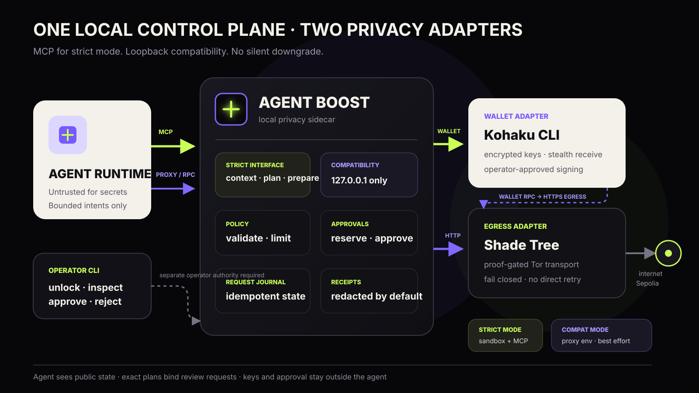

# Agent Boost

**Dark mode for your agent.**

Agent Boost is the design for a local privacy sidecar for AI agents. The POC is
scoped to keep wallet keys out of the agent process, route selected network and
Ethereum RPC traffic through proof-gated Tor egress, and place operator policy
between an agent's intent and an external side effect.

The first proof of concept is designed around two adapters behind one local
interface:

- [Kohaku CLI](https://github.com/kassandraoftroy/kohaku-cli) for fresh and
  stealth wallet operations;
- [Shade Tree Grove](https://github.com/dmarzzz/shade-tree-node) for
  proof-gated Tor egress.

Agent frameworks integrate with Agent Boost instead of learning each privacy
system independently. Wallet and egress implementations can change behind the
same local interface without changing how the agent reasons or acts.

> [!IMPORTANT]
> **Pre-release interface specification.** This repository currently defines
> the intended POC interface and acceptance contract. It does not yet contain a
> working release, and the commands below are the interface we are building—not
> a claim that this checkout already implements them.

> [!WARNING]
> **Research software.** The POC is testnet-only, unaudited, and intended for
> disposable credentials and funds. Do not use it for mainnet assets or traffic
> whose disclosure could cause harm.

## What the POC does

Agent Boost gives a local agent four bounded capabilities:

| Capability | Agent sees | Agent never sees |
| --- | --- | --- |
| Private fetch | Redacted response and receipt | Egress credentials |
| Understand its wallet | Public addresses, balances, reservations, fees, and limits | Seed, private key, or unlock material |
| Receive funds | Fresh address or stealth receive identifier | Derivation secrets |
| Prepare payment | Reviewable request ID and final status | Signing authority |

The wallet address and balance are intentionally available to the agent. They
are inputs to decision-making, not signing secrets: an agent cannot decide
whether to spend $10 without knowing what it owns, what is already reserved,
what the transaction will cost, and what policy permits. The operator still
owns the sensitive control plane. Unlocking a wallet and approving a signature
happen outside the model context and outside model-generated code.

## Planned release UX

The first event build targets macOS on Apple silicon, Sepolia, and disposable
funds. Its planned prerequisites are Node.js 22 or newer, Tor, a pinned Kohaku
CLI build, an operator-supplied Shade Tree v4 access profile, an HTTPS Sepolia
RPC endpoint, and a sandbox that can deny the agent ambient network and
operator-state access. Shade Tree does not currently publish a public v4 access
profile; enrollment data comes from the Grove operator and must remain outside
the repository and agent context.

Once implemented, the release UX will be one small lifecycle:

```console
git clone https://github.com/dmarzzz/agent-boost.git
cd agent-boost
make install

agent-boost init --network sepolia
agent-boost doctor
agent-boost up
agent-boost run --mode dark -- your-local-agent
```

`init` will create a local config and encrypted state directory. `doctor` will
verify the adapter binaries, process isolation, private egress, and the Ethereum
RPC route before any agent starts. `up` will start the sidecar on loopback and
an operator control Unix socket. `run` will give one child process the
compatibility environment described below.

To stop it:

```console
agent-boost down
```

No secret belongs in the repository, command history, process arguments, model
prompt, or agent-visible environment.

## Integration modes

### Strict mode: MCP tools

This is the recommended integration. The agent has no ambient network and gets
only the Agent Boost tools it needs. A typical MCP configuration will look like:

```json
{
  "mcpServers": {
    "agent-boost": {
      "command": "agent-boost",
      "args": ["mcp", "--mode", "dark"]
    }
  }
}
```

The POC contract defines seven intent-level tools:

- `capabilities` — report the contract version, live readiness, supported
  networks/features, guarantees, and explicit authority exclusions;
- `dark_fetch` — make a GET or HEAD request through the private route;
- `wallet_get_context` — return a coherent public wallet snapshot for general
  reasoning: addresses, balances, reservations, fees, and spend policy;
- `wallet_plan_payment` — evaluate exact payment terms and return explicit
  checks, blockers, and a short-lived decision ID;
- `wallet_create_receive` — create an idempotent fresh or stealth testnet
  receive identifier from an ordered set of acceptable kinds;
- `wallet_prepare_payment` — atomically revalidate a decision and create a
  reservation plus operator-review request;
- `wallet_get_request` — read durable, redacted request state.

The capability profile is also mirrored as the MCP resource
`agent-boost://capabilities/wallet/v1`. The resource is descriptive, never an
authority token. Operational tool results carry its digest and live readiness
so an agent does not need to remember to load the resource before acting.

For a real fail-closed guarantee, the agent must run in a sandbox or container
that denies direct network access. MCP constrains what the agent can ask Agent
Boost to do; the sandbox constrains what it can bypass.

### Compatibility mode: process wrapper

Existing agents can start without source changes:

```console
agent-boost run --mode dark -- your-local-agent --its --usual --flags
```

The wrapper injects `HTTP_PROXY`, `HTTPS_PROXY`, and an
`AGENT_BOOST_RPC_URL` pointing to Agent Boost's loopback endpoints. This is a
best-effort compatibility path because applications can ignore proxy variables
or open sockets directly. Run the child in a network-restricted sandbox before
calling this mode fail-closed.

See [Integration](docs/INTEGRATION.md) for lifecycle, MCP, compatibility, and
operator approval examples, and the [Capability contract](docs/CAPABILITY-CONTRACT.md)
for versioning, identifiers, authority, and result semantics.

## Wallet flow

For general wallet-dependent reasoning, the agent can read a coherent snapshot:

```text
wallet_get_context(chain_id="eip155:11155111")

→ account_id: eip155:11155111:0x…
→ balances: USDC total 25.00, spendable 18.00, reserved 7.00
→ fee asset: ETH, spendable 0.0098
→ policy remaining: 15.00 USDC
→ snapshot freshness and dark-route health
```

For a payment, the agent asks Agent Boost to evaluate the exact operation. The
agent does not join primitive reads or calculate feasibility from a total
balance alone:

```text
wallet_plan_payment(
  chain_id="eip155:11155111",
  to_account_id="eip155:11155111:0x…",
  asset_type="eip155:11155111/erc20:0x…",
  amount_atomic="10000000",
  fee_ceiling={
    asset_type: "eip155:11155111/slip44:60",
    amount_atomic: "30000000000000"
  }
)

→ address: 0x…
→ balances: USDC total 25.00, spendable 18.00, reserved 7.00
→ estimated network fee: 0.00002 ETH
→ policy remaining: 15.00 USDC
→ checks: principal pass, fee asset pass, policy pass, dark route pass
→ decision: allow
→ decision_id: wd_01J…
```

The read-only plan requires no operator approval and uses the private RPC route.
It binds the exact chain, account, destination, asset, amount, and fee ceiling
to an opaque, expiring decision ID. The ID is provenance, not authority. The
agent can then prepare an operator request without copying the payment terms a
second time:

```text
# Agent tool call returns req_01J...
wallet_prepare_payment(
  decision_id="wd_01J…",
  client_request_id="hermes-message-847-payment-1"
)
```

```console
# Operator control plane
agent-boost requests
agent-boost inspect req_01J...
agent-boost approve req_01J...
```

Preparation revalidates and atomically reserves principal, fee ceiling, and
policy allowance, then returns `awaiting_operator`. Plans never reserve funds.
Agent Boost asks the Kohaku adapter to sign only after approval, broadcasts over
the loopback RPC forwarder, and returns a redacted receipt. Immediately before
signing, Agent Boost refreshes balances, fees, nonce, reservations, policy, and
route health so stale state cannot authorize an unaffordable transaction.

Kohaku CLI currently routes privacy-related non-RPC HTTP over Tor but documents
Ethereum RPC separately. The POC therefore treats the RPC forwarder as a hard
security boundary: wallet RPC must go to Agent Boost on loopback, and Agent
Boost must send the upstream request through Shade Tree to an HTTPS upstream.
Plaintext upstream RPC is rejected because a Grove node would otherwise be able
to read or modify the JSON-RPC payload. A direct-RPC canary is part of `doctor`
and the end-to-end tests.

## First funding

A private wallet starts empty. A stealth receive identifier can reduce durable
address reuse, but it does not hide the funder's identity, the amount, or timing
on a public chain.

The POC makes that limitation visible:

```console
agent-boost wallet bootstrap --testnet
```

The command creates a one-time Sepolia destination and requests disposable test
funds over the private egress route. It is a demo bootstrap, not an anonymous
mainnet funding claim. The sponsor and chain observer can still correlate the
transfer.

## Architecture



Agent Boost exposes only local surfaces:

| Surface | Default | Purpose |
| --- | --- | --- |
| Agent tools | MCP over stdio | Strict intent-level integration |
| HTTP proxy | `127.0.0.1:9181` | Compatibility egress path |
| Ethereum JSON-RPC | `127.0.0.1:9182` | Forced wallet RPC path |
| Operator control | Unix socket; separate authority required | Unlock, inspect, approve, stop |

The sidecar never exposes an administrative TCP listener. Both TCP endpoints
bind to loopback. Wallet signing, policy, receipts, and adapter lifecycle stay
inside the operator boundary. A `0600` socket is not sufficient if the agent and
sidecar share an OS identity; the POC must run them under separate identities
with sandbox path denial, or require cryptographic operator authentication.

Read the full [Architecture](docs/ARCHITECTURE.md),
[Threat model](docs/THREAT-MODEL.md), and
[Capability contract](docs/CAPABILITY-CONTRACT.md).

## Configuration

The checked-in [example configuration](agent-boost.example.toml) contains no
credentials. Runtime secrets are loaded from protected local files or an
interactive prompt.

```toml
mode = "dark"
network = "sepolia"

[wallet]
adapter = "kohaku"
require_approval = true

[egress]
adapter = "shade-tree"
fail_closed = true

[rpc]
listen = "127.0.0.1:9182"
upstream_env = "AGENT_BOOST_RPC_UPSTREAM"
route = "egress"
require_https = true
```

## Failure contract

Dark mode has no silent downgrade:

- if Shade Tree is unhealthy, dark requests fail;
- if proxied RPC cannot be proven, wallet network operations fail;
- if wallet state cannot be refreshed to a specific block, Agent Boost returns
  an indeterminate decision and never produces `can_afford: true`;
- if Kohaku is locked, wallet operations pause for the operator;
- if approval expires or is rejected, no signature is produced;
- if receipt storage is unavailable, side-effecting requests fail before
  execution;
- compatibility mode is never labeled fail-closed without external network
  isolation.

## Acceptance contract

The first public POC is ready only when automated tests prove all of these:

1. A clean machine can install and pass `agent-boost doctor` from documented
   prerequisites.
2. Strict mode can fetch through Shade Tree while the agent has no direct
   network path.
3. Killing private egress fails the request without a clearnet retry.
4. A disposable Sepolia wallet can receive funds without revealing seed or
   private key to the agent.
5. `wallet_get_context` gives the agent public addresses, total/spendable/
   reserved balances, fee assets, policy allowances, and freshness without
   exposing signing material.
6. `wallet_plan_payment` checks principal, fee asset, policy, feature support,
   route health, and freshness for exact terms, returning asset-specific
   blockers or an intent-bound decision ID.
7. Every Kohaku RPC request reaches only the loopback forwarder and exits via
   the configured private route.
8. Preparing a payment atomically revalidates and reserves but cannot sign or
   broadcast until the operator approves the exact network, asset, amount,
   destination, and fee bound.
9. Receipts omit secrets, prompt contents, response bodies, and wallet unlock
   material by default.
10. Restarting the sidecar preserves encrypted wallet state and resolves pending
   requests without double-broadcasting.
11. The agent runtime cannot open the operator socket or wallet-state path even
    when it has terminal or code-execution tools.
12. Every agent-facing tool has versioned input and output schemas, and all
    checked-in examples validate against them.

## Intended repository layout

```text
agent-boost/
├── cmd/                 # agent-boost CLI and sidecar entry points
├── core/                # policy, approvals, lifecycle, and receipts
├── adapters/
│   ├── kohaku/          # wallet process adapter
│   └── shade-tree/      # egress process adapter
├── mcp/                 # strict agent-facing tool server
├── spec/                # versioned capability and result schemas
├── integrations/hermes/ # optional workflow skill and config example
├── config/              # schema, defaults, and migrations
├── tests/e2e/           # leak, failure, restart, and approval tests
├── docs/                # public technical documentation
└── assets/              # public diagrams and media
```

The adapter boundary is process-based. Agent Boost owns policy and orchestration
but does not absorb wallet cryptography or anonymity-network implementation.
Adapters can change without changing the agent-facing tool contract.

## Security scope

The POC is designed to reduce key exposure, direct destination-IP linkage, and
accidental unapproved signing. It does not protect against a compromised host,
global traffic analysis, application-layer identity such as logins and cookies,
wallet funding correlation, malicious destinations, chain analysis, or defects
in Kohaku, Shade Tree, Tor, upstream RPC providers, or Agent Boost itself.

Report security issues privately to the maintainers rather than opening a
public issue with exploit details. A dedicated disclosure channel will be added
before the first downloadable release.

## Media

[Share card (PNG)](assets/agent-boost-social-card.png) ·
[Share card (SVG)](assets/agent-boost-social-card.svg) ·
[Architecture (SVG)](assets/agent-boost-architecture.svg)

## License

No license has been selected yet. Do not assume reuse rights until a `LICENSE`
file is present; choosing one is a release blocker.
