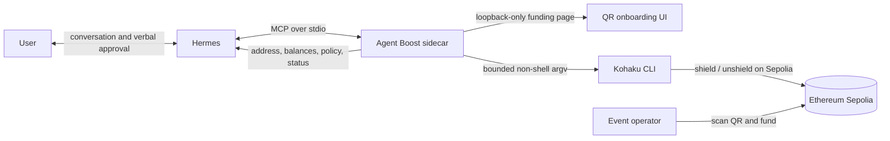

# Agent Boost

**Dark mode for your agent.**

Agent Boost is a local, wallet-first privacy sidecar for AI agents. This proof
of concept gives a Hermes agent the public wallet facts it needs to reason—its
Sepolia address, live balances, setup state, and remaining allowance—while
keeping seed phrases, private keys, wallet passwords, and raw privacy notes out
of MCP results and the model conversation.

The current build demonstrates one complete path:

1. Hermes asks Agent Boost to create a disposable Sepolia wallet.
2. Agent Boost opens a local funding page with an exact QR code and address.
3. An event operator sends approximately `0.2` valueless Sepolia ETH.
4. Agent Boost automatically shields `0.1` Sepolia ETH through Kohaku.
5. The user asks Hermes to send one shielded test payment.
6. Hermes reads the live balance, plans the exact transfer, reads the terms
   back, and waits for verbal confirmation.
7. Agent Boost signs and submits within a Sepolia-only, one-payment delegation.

No terminal is needed after the one-time installation. On a graphical local
machine, the funding page opens in the browser. On a headless host, Agent Boost
returns the QR image through MCP so Hermes can present it in chat.

> [!WARNING]
> Agent Boost and Kohaku are unaudited research software. This release is
> Sepolia-only and intended for disposable test funds. Sepolia ETH has no
> monetary or redeemable value. Never send mainnet assets, real value, or a
> wallet you care about.

## Install

Supported hosts:

- macOS on Apple silicon;
- macOS on Intel;
- Ubuntu 24.04 on ARM64.

The complete clean-install flow has been exercised on macOS Apple silicon.
Host detection, paths, and installer behavior are covered for Intel macOS and
Ubuntu ARM64, but those two targets still need clean-machine execution evidence
before the event release is tagged.

Prerequisites are Git, Node.js 22 or newer, npm, and a working Hermes install.
The installer builds the repository, installs Agent Boost under `~/.local`,
fetches and verifies the pinned Kohaku commit, and configures the active Hermes
profile without replacing a conflicting MCP entry.

```console
git clone https://github.com/dmarzzz/agent-boost.git
cd agent-boost
make install
```

The default executables and state paths are:

```text
~/.local/bin/agent-boost
~/.local/share/agent-boost/dependencies/kohaku-cli/
~/.local/share/agent-boost/state.json
~/.local/share/agent-boost/kohaku/
~/.local/share/agent-boost/secrets/kohaku-password
```

If the installer says `~/.local/bin` is not on `PATH`, add it before continuing.
Then verify the host:

```console
agent-boost doctor
```

If Hermes was not available during installation, configure it later with:

```console
agent-boost install-hermes
```

Restart Hermes once. In an already-running Hermes conversation, the no-restart
alternative is `/reload-skills` followed by `/reload-mcp` locally, or
`!reload-skills` followed by `!reload-mcp` over Matrix.

The installer pins Kohaku to commit
[`fcf9defa4d5ff7f63222f1b3bbe2d30e631ceffd`](https://github.com/kassandraoftroy/kohaku-cli/commit/fcf9defa4d5ff7f63222f1b3bbe2d30e631ceffd)
and records local SHA-256 provenance for its lockfile, launcher, and compiled
bundle. A managed installation is reused only when its pin and hashes still
match.

The Kohaku runtime is currently large: approximately 765 MiB after production
pruning, before proving artifacts. Its pinned production dependency tree also
reports 44 known npm advisories (38 moderate and 6 high) as of this release
candidate. That unresolved upstream risk is another reason this build is
strictly disposable-testnet software.

## Run the demo

### 1. Set up the wallet

Tell Hermes:

> Set up Agent Boost.

Hermes calls `onboarding_start`. Agent Boost creates or resumes one durable
Sepolia setup and opens the funding page. The page shows an EIP-681 QR code for
the exact remaining amount, the full address, public funding progress, and
private-balance progress.

Ask the event operator to scan the QR and send the amount shown—normally `0.2`
Sepolia ETH. Partial funding is supported: the QR automatically updates to the
remaining amount. Do not send ETH on mainnet or another network.

Hermes long-polls durable setup state without flooding the conversation:

```text
creating_wallet
  → preparing_privacy
  → awaiting_funding
  → funding_pending
  → funded_public
  → shielding
  → private_ready
```

When `private_ready` appears, at least `0.1` Sepolia ETH is spendable through
the configured private-payment path.

### 2. Send one test payment

Tell Hermes, for example:

> Send 0.02 Sepolia ETH privately to
> 0x2222222222222222222222222222222222222222.

Hermes first reads current wallet context and creates a short-lived plan. It
must read back the recipient, exact ETH and wei amount, Sepolia network,
remaining delegation, expiry, and privacy limitations. Nothing is sent until
the user verbally confirms those exact terms.

Agent Boost does not listen to the conversation itself. Hermes reports the
user's confirmation with `user_confirmed: true`; this is a conversational demo
control, not independent authentication or an out-of-band approval channel.

After confirmation, Hermes executes the immutable plan with a stable request
ID. The default policy permits:

- Sepolia only (`eip155:11155111`);
- native test ETH only;
- at most `0.05` ETH;
- one payment for the lifetime of the setup;
- execution within 24 hours of setup;
- no mainnet path.

Agent Boost asks Kohaku to unshield the `0.1` ETH note to a fresh
wallet-controlled account and append the exact recipient transfer as a tail
call. Kohaku waits for UserOperation inclusion. Agent Boost additionally checks
that the recipient's public balance increased by at least the requested amount
before reporting `confirmed`; otherwise the durable result remains `submitted`
or unresolved rather than guessing.

## What Hermes can see

The agent needs state to make decisions, so address and balance visibility is
intentional.

| Hermes can read | Not returned through Agent Boost tools |
| --- | --- |
| Sepolia address and chain ID | Seed phrase and private keys |
| Live funding-address balance | Kohaku wallet password |
| Live aggregate public-wallet ETH | Raw Tornado notes and proofs |
| Live private-payment spendable ETH | Raw signed transactions |
| Delegation limits, expiry, and use | RPC URL and local filesystem paths |
| Plan, request, and confirmation state | Arbitrary Kohaku command execution |

The MCP surface contains seven native tools:

| Tool | Purpose |
| --- | --- |
| `capabilities` | Contract, live readiness, policy, and privacy limits |
| `onboarding_start` | Create or resume setup and open/present funding UI |
| `onboarding_status` | Long-poll durable setup progress by revision |
| `wallet_get_context` | Refresh address, balances, and delegation state |
| `wallet_plan_private_payment` | Validate one exact recipient and wei amount |
| `wallet_execute_private_payment` | Execute a confirmed, unexpired plan |
| `wallet_get_request` | Read durable redacted request state |

All monetary authority values use canonical integer strings in wei. Plans are
read-only, expire after five minutes, and bind recipient plus amount in a
SHA-256 intent digest. Execution revalidates setup, private balance, the
Sepolia chain ID, configured execution limit, one-payment rule, lifetime
allowance, expiry, and idempotency before invoking Kohaku.

## Architecture



Agent Boost starts as the Hermes MCP child process and resumes its durable local
state after restarts. The onboarding web server binds only to `127.0.0.1`
(default port `9183`), accepts only loopback hosts and same-origin requests, and
serves a read-only UI with a restrictive Content Security Policy. Port `9180`
is deliberately reserved so this POC cannot collide with an older local
service. A separate exclusive loopback bind on port `9184` is a crash-safe
process ownership lock; a second Agent Boost process fails closed instead of
sharing the wallet.

Local state writes are flushed and atomically renamed. Agent Boost directories
are hardened to `0700` and state, password, wallet, and provenance files to
`0600`. Kohaku commands run without a shell, are serialized per wallet, pass
the RPC endpoint through the child environment rather than argv, and never
return raw upstream stderr through MCP.

See [Integration](docs/INTEGRATION.md),
[Capability contract](docs/CAPABILITY-CONTRACT.md),
[Architecture](docs/ARCHITECTURE.md), and
[Threat model](docs/THREAT-MODEL.md) for the exact boundaries.

## Privacy claims and limits

The accurate claim for this POC is:

> A privacy-improving, shielded Sepolia test payment.

It is not a guarantee of anonymity.

- Initial funding is public. The funder, destination, amount, and timing are
  visible on Sepolia.
- Shielding and later unshielding break the direct deposit/withdrawal link, but
  timing, amounts, a small testnet anonymity set, and protocol activity may
  still correlate them.
- Ethereum RPC is HTTPS but not privately routed in this wallet-first build.
  The RPC provider can observe requests and network metadata.
- Kohaku uses Tor for supported non-RPC privacy-protocol traffic, but Agent
  Boost has not yet added general private egress.
- A fresh or stealth address alone does not hide its funding transaction.
- The disposable wallet has no recovery or export UX in Agent Boost.
- Recipient-balance-delta confirmation proves delivery of at least the amount;
  it is not cryptographic attribution when unrelated concurrent transfers are
  possible.

The next module is anonymous egress. It is intentionally not claimed or exposed
by this release.

## Local security boundary

Agent Boost keeps secrets out of tool results, prompts, command arguments, and
normal logs. That is useful, but it is not an operating-system custody boundary
when Hermes and Agent Boost run as the same user. A locally privileged agent
with unrestricted shell and filesystem access could read both the encrypted
Kohaku wallet and its local password file. The Hermes skills tell the agent not
to do this; instructions are not enforcement.

For this POC, the practical safety boundary is disposable Sepolia-only funds,
a maximum one-time payment, no mainnet configuration, and explicit verbal
confirmation. A future real-value release would require a separate service
identity or hardware/cryptographic signer that the agent process cannot access.
The confirmation boolean is supplied by Hermes, so a compromised Hermes has
the same authority as a falsely confirmed conversation within these limits.

## Configuration

The POC is deliberately small and uses environment variables rather than a
secret-bearing repository config.

| Variable | Default | Meaning |
| --- | --- | --- |
| `AGENT_BOOST_RPC_URL` | Public HTTPS Sepolia RPC | Sepolia JSON-RPC endpoint; HTTPS required |
| `AGENT_BOOST_UI_PORT` | `9183` | Loopback funding page port; `9180` and lock port `9184` forbidden |
| `AGENT_BOOST_FUNDING_WEI` | `200000000000000000` | Requested initial funding |
| `AGENT_BOOST_SHIELD_WEI` | `100000000000000000` | Tornado shield/note amount |
| `AGENT_BOOST_PAYMENT_LIMIT_WEI` | `50000000000000000` | One-payment maximum |
| `AGENT_BOOST_OPEN_UI` | `true` | Attempt to open a graphical browser |
| `AGENT_BOOST_EXECUTE` | `true` | Enable bounded testnet execution |
| `AGENT_BOOST_STATE_DIR` | `~/.local/share/agent-boost` | Durable state root |

The RPC URL is never returned through the MCP interface. Do not put credentialed
URLs in the repository or paste them into a model conversation.

## Development

```console
npm ci
npm run check
npm test
npm run build
node dist/cli.js doctor
```

Focused dependency repair:

```console
make install-kohaku
```

`npm test` covers policy and idempotency, state permissions, command injection
resistance, exact Kohaku argv, Sepolia-only RPC, MCP schemas, Hermes config
drift, QR contents, loopback request filtering, UI state honesty, responsive
layout contracts, and recipient-delivery confirmation.

## License

No license has been granted yet. Treat this repository as all rights reserved
until a license file is added.
