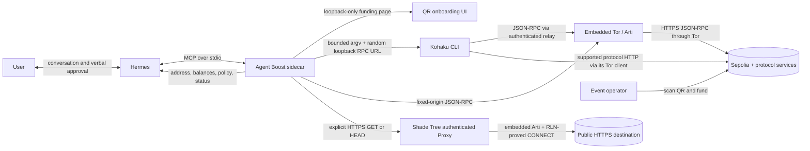

# Architecture



Agent Boost is a local, wallet-first sidecar between Hermes and Kohaku. It owns
the agent-facing contract, durable workflow state, delegated-spend policy,
onboarding UI, and redacted results. Kohaku owns wallet derivation, encrypted
seed storage, Tornado proving, signing, and broadcast.

## Components

| Component | Responsibility |
| --- | --- |
| Hermes | Conversation, fallback readback, MCP orchestration |
| Agent Boost MCP server | Schemas, policy, state, idempotency, UI lifecycle |
| Onboarding UI | Read-only loopback QR, address, funding and shield progress |
| Kohaku adapter | Wallet operations through fixed, non-shell argv |
| Tor RPC route | Embedded Arti client, fixed HTTPS origin, remote DNS, no direct fallback |
| Loopback RPC relay | Random-path JSON-RPC bridge from Kohaku to the Tor route |
| Sepolia RPC client | Tor-routed chain assertion and live public balance reads |
| State store | Atomic durable setup, plan, request, delegation, wallet-profile, and archive records |

The first release contains no general agent egress or operator approval
dashboard. Its proxy is narrowly limited to the configured Sepolia RPC origin.

## Local surfaces

- MCP: stdio only;
- onboarding page: `127.0.0.1:9183` by default;
- runtime ownership lock: exclusive `127.0.0.1:9184` bind;
- authenticated fixed-origin RPC relay: `127.0.0.1:9185` by default;
- state: `~/.local/share/agent-boost` by default.

The UI server rejects non-loopback Host headers, cross-site browser requests,
methods other than GET/HEAD, and framing. It uses no remote assets and returns
only an explicit public snapshot.

## Onboarding state machine

```text
not_started
  → creating_wallet
  → preparing_privacy
  → awaiting_funding
  → funding_pending
  → funded_public
  → shielding
  → private_ready

any active phase → failed
```

The wallet and fresh main account address are created before the QR appears.
Proving-artifact preparation continues while the user funds. The watcher polls
the exact address until the configured target arrives, persists `shielding`
before invoking Kohaku, and waits for the private spendable balance rather than
assuming a returned hash means readiness.

On restart:

- wallet creation and privacy preparation resume;
- funding states resume address polling;
- `shielding` resumes private-balance polling without automatically sending a
  duplicate shield.

This favors avoiding duplicate side effects. A crash after persisting
`shielding` but before Kohaku receives the command may require operator
diagnosis rather than an automatic retry.

## Payment flow

```text
wallet_list
  → select registered wallet ID or adopt a local Sepolia name
  → confirmation → restore durable wallet state + disable stale authority
  → wallet_plan_reauthorization
  → separate confirmation → wallet_reauthorize

wallet_get_context
  → live main account address + its on-chain balance
  → wallet_get_policy / wallet_plan_policy_update
  → separate confirmation → wallet_apply_policy_update
  → wallet_plan_regular_transfer(recipient, amount)
    → confirmation → public main-account transfer → durable status
  → wallet_plan_private_payment(recipient, amount)
  → native one-shot confirmation of immutable plan
    ↳ structured readback + verbal confirmation only if elicitation is unavailable
  → wallet_execute_private_payment(decision_id, stable client ID)
  → Kohaku unshield --next + exact value tail call
  → submitted
  → transaction receipt or recipient balance delta verified
  → confirmed

wallet_plan_recovery_transfer(recipient, exact amount)
  → separate confirmation → exact unshield + public tail call
  → durable status; unresolved results are never replaced
```

The plan checks balance and policy but creates no side effect. Immediately
before signing, execution asserts Sepolia again, refreshes the spendable
private balance, and rechecks the kill switch, delegation chain, expiry,
per-payment limit, lifetime limit, and remaining payment count. It then writes an
`executing` request and consumes the allowance before invoking Kohaku. The
recipient's pre-execution balance is stored in that same durable request
before the adapter call. This prevents a crash or error from making a possibly
submitted payment look safely repeatable and makes later read-only
reconciliation possible. UserOperation and transaction hashes are separate
fields; only a true transaction hash is queried as a transaction receipt.

Policy updates use the same plan/confirm/apply shape without touching the
network. A policy preview binds current use and proposed limits. Apply fails
closed if a payment or another policy update races it, while a repeated apply
of the same successful decision returns the original receipt.

Kohaku's Tornado path withdraws the configured `0.1` ETH note to the next fresh
EIP-7702 payment subaccount. The recipient payment is an exact tail call;
the paymaster fee and remaining change are separate from the recipient amount.

## Live balance semantics

`wallet_get_context` reports one balance: `balance_atomic`, the live
`eth_getBalance` value for its returned main account address. This is the same
address/value pair a Sepolia explorer displays. Setup funding targets and
subaccount or shielded balances are not added to the main account balance.

"Main" describes a funding source only. Funding a subaccount is an ordinary
one-way transfer and grants the main account no signing authority, ownership,
recovery capability, revocation capability, or right to move the subaccount's
funds. The names do not define a custody hierarchy.

The runtime makes this machine-readable as
`account_role: main_funding_source` and `controls_subaccounts: false`. Before
publishing `wallet_get_context`, the MCP boundary rejects missing or malformed
address/balance pairs and any second balance-shaped field at any nesting depth.

Payment planning refreshes its private spendability internally, so Hermes
cannot authorize a payment from the displayed address balance alone.

## Filesystem and subprocess behavior

- directories are created or corrected to `0700`;
- state, wallet, secret, and provenance files are corrected to `0600`;
- state writes flush a unique temporary file, atomically rename it, and flush
  the containing directory;
- the password is generated locally and passed to Kohaku by file path;
- Kohaku invocations use argv arrays with `shell: false`;
- the RPC URL is supplied through the child environment rather than argv;
- Kohaku receives only the random authenticated loopback relay URL, never the
  upstream provider URL;
- inherited proxy variables and `KOHAKU_WITHOUT_TOR` are removed;
- a child-process fetch guard permits loopback only and blocks Kohaku's built-in
  public RPC fallback candidates;
- the random relay token is redacted from Kohaku's traffic log after each call;
- a process-shared loopback lock prevents concurrent wallet runtimes;
- output and execution time are bounded;
- operations are serialized by Kohaku data directory, including wallet-profile
  changes.

A confirmed demo reset first stops onboarding and drains payment execution. It
creates a new Kohaku profile, writes the complete prior state into a private
archive directory, atomically replaces active state with the new profile, and
starts onboarding. The old wallet and request history are retained locally;
none of their side effects are replayed.

Selecting a retained profile follows the same drain-and-archive boundary, then
restores that profile's onboarding state, increments its selection epoch, and
deletes prior signing authority. A separately confirmed reauthorization is
required before another regular or private transfer can be planned. Archived
profiles retain encrypted data and become available again when selected.

The Kohaku installation is built from a fixed commit in a staging directory,
verified, hashed, and atomically renamed into place. An unmanaged target is
never overwritten.

## Failure behavior

| Failure | Behavior |
| --- | --- |
| RPC is not hostname-based HTTPS or not Sepolia | Fail before wallet setup |
| Tor bootstrap, RPC, or relay fails | Fail closed; never retry directly |
| Funding is partial | Keep waiting and update QR to the remainder |
| Funding or private balance times out | Durable retryable failure |
| Kohaku command fails | Redacted failure; no shell fallback |
| Plan expired or delegation used | Reject before adapter call |
| A second Agent Boost process starts | Fail closed on the runtime ownership lock |
| User did not confirm | Reject before durable request |
| Submission cannot be proven delivered | Keep `submitted`/unresolved; reconcile later without broadcast |
| User requests a fresh demo | Require confirmation, archive state and old wallet, then create a new funding QR |
| UI cannot open | Return QR through MCP when possible |
| UI port unavailable | Continue with MCP QR/address fallback |
| General egress unavailable | Report it; never claim the RPC route covers it |

## Runtime surfaces and hardening

Agent Boost starts as the Hermes MCP child process and resumes its durable local
state after restarts. The onboarding web server binds only to `127.0.0.1`
(default port `9183`), accepts only loopback hosts and same-origin requests, and
serves a read-only UI with a restrictive Content Security Policy. Port `9180`
is deliberately reserved so this POC cannot collide with an older local
service. A separate exclusive loopback bind on port `9184` is a crash-safe
process ownership lock; a second Agent Boost process fails closed instead of
sharing the wallet. A fixed-destination JSON-RPC relay binds to `127.0.0.1:9185`
with a random 256-bit path token. It accepts JSON-RPC POST only, forwards only
to the configured HTTPS Sepolia origin through Tor, and has no direct retry.
The optional Shade Tree Proxy binds separately to `127.0.0.1:9186`, requires a
fresh in-memory 256-bit authentication token, and is reachable only through the
three bounded egress tools. Its member identity stays in owner-only local
files; its forward-only slot cursor is persisted separately and is never reset
or rewound to reclaim capacity.

Local state writes are flushed and atomically renamed. Agent Boost directories
are hardened to `0700` and state, password, wallet, and provenance files to
`0600`. Kohaku commands run without a shell, are serialized per wallet, pass
only the authenticated loopback relay through the child environment rather
than the upstream RPC URL or argv, and never return raw upstream stderr through
MCP. Inherited proxy variables and Kohaku's Tor-disable switch are scrubbed.
A child-process network guard rejects Kohaku's built-in public RPC fallbacks;
only loopback fetches are allowed, including Kohaku's own Tor-backed Pimlico
relay. Kohaku's traffic log is scrubbed of the live Agent Boost relay token
after every invocation.
