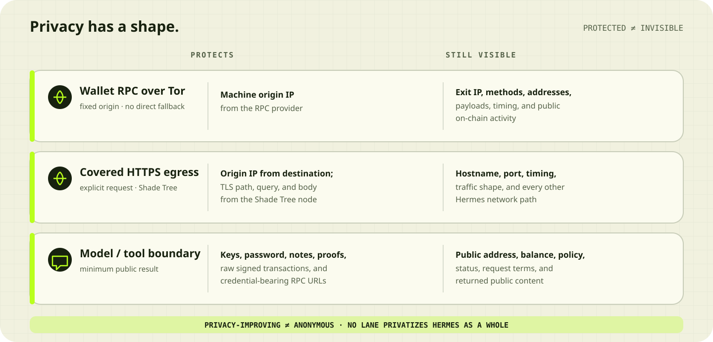

# Privacy claims and limits

Agent Boost improves privacy along specific paths. It does not promise
anonymity, make Hermes private as a whole, or create an operating-system custody
boundary.

The accurate claims for this preview are:

> **Wallet:** a privacy-improving, shielded Sepolia test payment.
>
> **Egress:** a privacy-improving, explicitly requested public HTTPS read
> through Shade Tree.

## On-chain activity

Initial funding is public. The funder, destination, amount, and timing are
visible on Sepolia. Shielding and later unshielding break the direct
deposit/withdrawal link, but timing, amounts, a small testnet anonymity set, and
protocol activity may still correlate them.

A fresh or stealth address alone does not hide its funding transaction. The
recipient is public after payment, and recipient-balance-delta confirmation
proves delivery of at least the amount rather than cryptographic attribution
when unrelated concurrent transfers are possible.

## Wallet RPC and protocol traffic

Agent Boost and Kohaku route Ethereum JSON-RPC over Tor with remote hostname
resolution and no direct fallback. This hides the machine's origin IP from the
RPC provider. The provider still sees the Tor exit IP, RPC methods, wallet
addresses, payloads, and timing.

Kohaku separately uses Tor for supported privacy-protocol HTTP traffic. A Tor
route reduces network visibility; it does not prevent a sufficiently capable
observer from correlating timing and traffic shape.

## Covered HTTPS egress

After enrollment, explicit `egress_fetch` calls can use Shade Tree. The
destination sees a Shade Tree node address rather than the user's origin. The
node sees the destination hostname and port plus timing, connection lifetime,
and traffic volume. End-to-end TLS hides the path, query, and body from the
node, assuming certificate validation holds.

The covered request is the entire scope. Hermes, its model provider, Matrix,
plugins, updates, the browser, wallet RPC, and all other process traffic retain
their existing routes. Agent Boost never turns a failed covered request into a
clearnet or raw-Tor retry.

## Model and tool boundary

Agent Boost keeps seed phrases, private keys, the local wallet password, raw
Tornado notes and proofs, credential-bearing RPC URLs, and raw signed
transactions out of MCP results and the ordinary model conversation.

Hermes intentionally receives the public facts it needs to act correctly:
addresses when required, live balance, readiness, policy, exact request terms,
status, and public transaction references. Data returned by covered egress is
also visible to the calling model and is marked `untrusted_external`.

Public-on-chain does not mean “display everywhere.” Normal responses should
still expose only the minimum public facts needed for the user's question.

## Local security boundary

MCP omission is not same-user isolation. Hermes and Agent Boost normally run
under the same OS account in this preview. A locally privileged agent with
unrestricted shell and filesystem access could read both the encrypted Kohaku
wallet and its local password file or inspect another same-user process. Skill
instructions discourage that behavior; they do not enforce an OS boundary.

The practical safety boundary is:

- disposable, valueless Sepolia funds only;
- a bounded, expiring payment delegation—10 sends of up to 1 Sepolia ETH each
  and 10 Sepolia ETH total by default;
- explicit confirmation under the default execution policy;
- no mainnet configuration or direct RPC fallback;
- hard testnet ceilings that a conversational policy update cannot exceed.

Demo reset archives prior state and retains the old Kohaku wallet locally. Agent
Boost still has no seed export or guided wallet-recovery UX. A future real-value
release would require a separate service identity, hardware-backed signer, or
cryptographic authorization that the agent process cannot access.

The confirmation boolean is supplied by Hermes, so a compromised Hermes has the
same authority as a falsely confirmed conversation inside the active limits.
See the [threat model](THREAT-MODEL.md) for attacks, mitigations, and residual
risk, and [Covered egress](COVERED-EGRESS.md) for the complete request policy.
